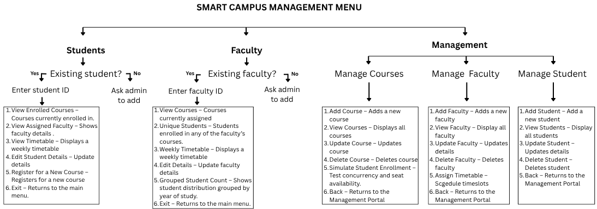
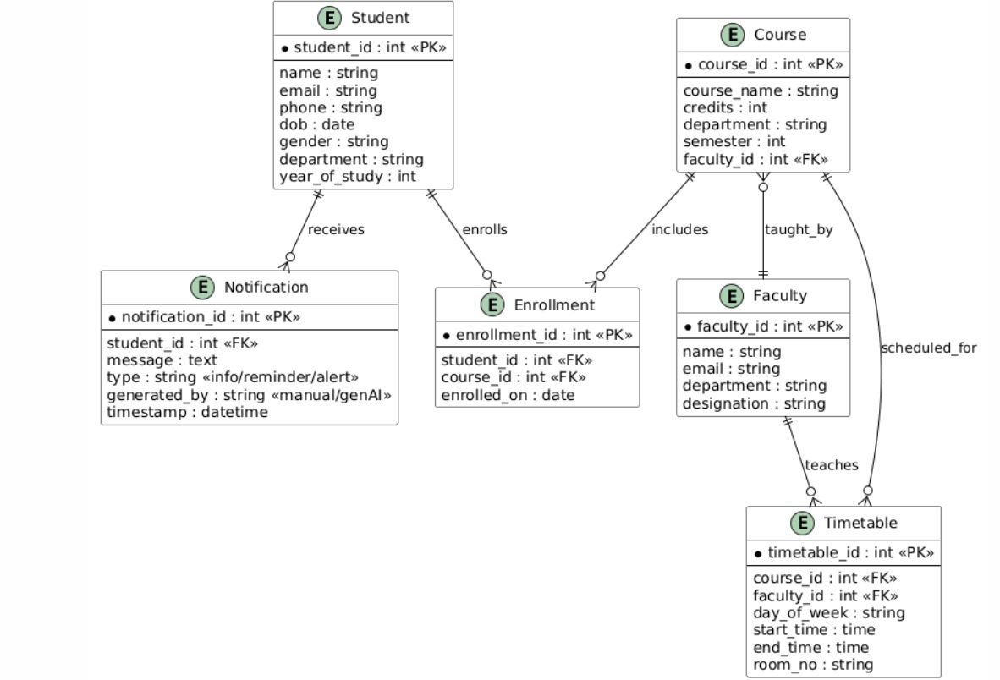

# 🎓 Smart Campus Management System 

## 📌 Sprint 1: Foundational Development

This is the foundational sprint for a Smart Campus Management System (SCMS) built using Core Java, JDBC, and SQL. The system supports basic operations like student registration, course management, timetable structuring, faculty assignment, and input/output handling.

## 🛠️ Features Implemented

- Student and faculty registration
- Course and timetable allocation
- Exception handling for validation
- Thread-based simulation of concurrent enrollments
- Input validation with utility classes
- Complete JDBC CRUD operations
  
## 🛠️ WorkFlow
The Smart Campus Management System is modularized into three main components: Students, Faculty, and Management. Below is a summary of features implemented across these modules:


🎓 Student Module
- Student registration and profile management
- Course enrollment with input validation
- View enrolled courses and assigned faculty
- Timetable generation (Monday to Friday, 09:00–17:00)
- Email and phone number validation
- JDBC-based CRUD operations for student data

👨‍🏫 Faculty Module
- Faculty login with ID authentication
- View assigned courses and enrolled students
- Weekly teaching timetable display
- Update faculty details (e.g., email) with validation
- Grouped student distribution analysis

🏢 Management Portal
- Manage Courses (Add, View, Update, Delete, Simulate Enrollments)
- Manage Faculty (Add, View, Update, Delete, Assign Timetables)
- Manage Students (Add, View, Update, Delete)
- Thread-based simulation for concurrent enrollments
- Input validation and exception handling (custom exceptions included)

## 🔗 Entity-Relationship Diagram 


## 🧩 Entities and Their Relationships

### 🧑‍🎓 Student
- **student_id** (Primary Key): Unique ID for each student.
- **Attributes**: `name`, `email`, `phone`, `dob`, `gender`, `department`, `year_of_study`

### 📬 Notification
- **Related to Student** through `student_id` (Foreign Key).
- A student **receives notifications**.
- **Attributes**: 
  - `type` (info, reminder, alert)  
  - `generated_by` (manual, genAI)  
  - `timestamp`

### 📝 Enrollment
- **Junction table** between Student and Course.
- A student **enrolls in multiple courses**.
- **Attributes**:
  - `enrollment_id` (Primary Key)  
  - `student_id`  
  - `course_id`  
  - `enrolled_on`

### 📚 Course
- **course_id** (Primary Key): Unique course identifier.
- **Attributes**: `course_name`, `credits`, `department`, `semester`
- Each course is **taught by a Faculty** (`faculty_id` as Foreign Key)


### 👨‍🏫 Faculty
- **faculty_id** (Primary Key): Unique faculty identifier.
- **Attributes**: `name`, `email`, `department`, `designation`
- A faculty member:
  - Teaches courses (linked via **Course**)
  - Is scheduled for specific slots in the **Timetable**

### 📅 Timetable
- **Manages scheduling**
- **Foreign Keys**: `course_id`, `faculty_id`
- **Attributes**: `day_of_week`, `start_time`, `end_time`, `room_no`

## 🔁 Step-by-Step System Flow
### ✅ 1. Student Registration & Notifications
- A student is created with `student_id`.
- They receive notifications (reminders, alerts, info) stored in the **Notification** table.

### ✅ 2. Enrollment Process
- Students enroll in courses via the **Enrollment** table.
- This creates a **many-to-many** link between **Student** and **Course**.

### ✅ 3. Course-Faculty Link
- Each course is assigned to a faculty using `faculty_id`.
- So, when a student enrolls in a course, they are indirectly connected to the assigned faculty.

### ✅ 4. Timetable Scheduling
- Faculty are scheduled for specific time slots for each course in the **Timetable**.
- This helps build a **weekly timetable view** for both students and faculty.

## Entity Relationships
| Entity  | Relation                | With Entity  | Notes                                                            |
|-------- |------------------------|--------------|------------------------------------------------------------------|
| Student | Receives               | Notification | 1:M (One student can receive many notifications)                |
| Student | Enrolls                | Course       | M:N (Many students can enroll in many courses via `Enrollment`) |
| Course  | Includes (is taught by)| Faculty      | M:1 (Each course is taught by one faculty)                      |
| Faculty | Teaches                | Timetable    | 1:M (One faculty can have many timetable entries)               |
| Course  | Is scheduled in        | Timetable    | 1:M (One course can have multiple schedule entries)             |

## 📁 Project Structure
```plaintext
src/
├── campus/
│   ├── Main.java
│   ├── Faculty.java
│   ├── Students.java
│   └── Management.java
├── exception/
│   ├── FacultynotfoundException.java
│   └── InvalidEmailFormatException.java
├── pojos/
│   ├── StudentPOJO.java
│   └── FacultyPOJO.java
├── validator/
│   └── InputValidator.java
└── module-info.java

📄 External Files
├── database.sql                   # Full database schema and sample data (DDL + DML)
├── Database Designer.sql          # Indexes and views for optimized design and access
├── Database Developer.sql         # SQL scripts for queries and operations

```

## 🗄️ Database Setup

1. **Create your MySQL database**:
   ```sql
   CREATE DATABASE smart_campus;
   USE smart_campus;

2. Import the schema:
Import the full schema and sample data using the provided database.sql file. This includes all tables like:
    - students : Stores personal and academic details of each student.
    - faculty : Contains information about faculty members and their roles.
    - courses : Defines course details, including department, credits, and assigned faculty.
    - timetable : Schedules classes with specific timings, rooms, and instructors.
    - enrollments : Tracks which students are enrolled in which courses.
    - notification : Stores alerts and messages sent to students with timestamps.
  
    The database.sql file contains all DDL (table creation) and DML (inserts) required for the project.

3. Configure DB credentials in your code (in Main.java or utility class):
    ```
    String url = "jdbc:mysql://localhost:3306/smart_campus";
    String user = "your_username";
    String password = "your_password";
## 🚀 How to Clone and Run the Project

Follow these steps to clone and run the Smart Campus Management System project in Eclipse:

### 1️⃣ Clone the Repository
```bash
git clone https://github.com/jobin2201/smartcampus.git
```
### 2️⃣ Open in Eclipse
  - Open Eclipse IDE.
  - Go to File > Import.
  - Select Existing Projects into Workspace under General.
  - Browse to the cloned folder and select the project.
  - Click Finish.
### 3️⃣ Set Up Database
  - Ensure you have MySQL installed and running.
  - Create the required database and tables using the provided SQL schema.
  - Update the JDBC connection URL, username, and password in your code (if not already set via a config).
### 4️⃣ Build and Run
  - Right-click on Main.java.
  - Select Run As > Java Application.

## 📝 License

This project is licensed under the [MIT License](LICENSE).
